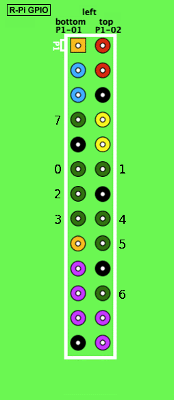

.. _usage:

Usage
=====

Request
-------
The following example shows how to enable GPIO 3, or SOC GPIO 22. When you run Geppetto in 
development mode the Authorization header redundant. Authentication has been
disabled in development mode.

::

    >>> import requests, json, base64
    >>> # Create Authorization header.
    >>> auth = {'Authorization': base64.b64encode('fcba99ca-3360-4683-a54d-1ce8ad1f20f3').encode('utf-8')}
    >>> # Create body of POST request.
    >>> data = json.dumps({'value': 1})
    >>> # Do POST request.
    >>> requests.post('http://localhost:5000/gpio/3/setpoint', headers=auth, data=data)
    <Response [200]>

Pin numbering
-------------
Geppetto uses the `WiringPi`_'s numbering scheme for selecting GPIO pins.

Image is modification of image from `Wikipedia`_ and is available under 
`CC BY-SA 3.0`_.

.. _CC BY-SA 3.0: http://creativecommons.org/licenses/by-sa/3.0/deed.en
.. _WiringPi: http://wiringpi.com/pins/
.. _Wikipedia: http://upload.wikimedia.org/wikipedia/commons/6/61/Raspberry-pi-gpio.png
